# Auth & RBAC ERD

## Scope

This document describes the normalized RBAC persistence model introduced in FO-003A.

## Diagram

```mermaid
erDiagram
    ACCOUNT ||--o{ ACCOUNT_ROLE : has
    ROLE ||--o{ ACCOUNT_ROLE : assigned

    ROLE ||--o{ ROLE_PERMISSION : has
    PERMISSION ||--o{ ROLE_PERMISSION : assigned

    ACCOUNT {
        uuid id PK
        varchar email UK
        varchar phone UK
        varchar password_hash
        varchar status
        boolean email_verified
        boolean phone_verified
        timestamptz last_login_at
        timestamptz created_at
        timestamptz updated_at
        timestamptz deleted_at
    }

    ROLE {
        uuid id PK
        varchar code UK
        varchar name
        varchar description
        boolean is_system
        timestamptz created_at
        timestamptz updated_at
    }

    PERMISSION {
        uuid id PK
        varchar code UK
        varchar description
        timestamptz created_at
        timestamptz updated_at
    }

    ACCOUNT_ROLE {
        uuid id PK
        uuid account_id FK
        uuid role_id FK
        timestamptz created_at
    }

    ROLE_PERMISSION {
        uuid id PK
        uuid role_id FK
        uuid permission_id FK
        timestamptz created_at
    }
```

## Persistence invariants

- `account_roles` enforces `UNIQUE(account_id, role_id)`.
- `role_permissions` enforces `UNIQUE(role_id, permission_id)`.
- Role and Permission codes are canonical machine-readable identifiers.
- Global RBAC does not imply ownership of Store/Product/Order resources.
- Account lifecycle/status is independent from role membership.

## High-resolution reference

[Open the rendered RBAC ERD on Google Drive](https://drive.google.com/file/d/1HZM9LXSIdz5nwKzyJyi5sylSgnW2dvVO/view?usp=drivesdk)

## Related work

- #3 — FO-003 Auth + Account + normalized RBAC and sessions
- #7 — FO-003A Account + normalized RBAC persistence foundation
